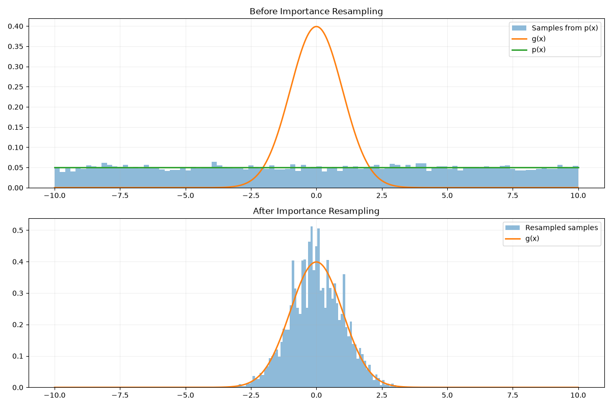
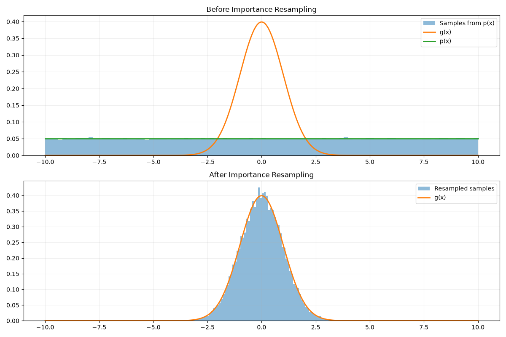

## Abstract 

Importance resampling 是一种样本生成技术，它可以较为轻松的生成符合 importance sampling 的样本，能显著减少标准 importance sampling 在常见渲染问题上
的方差，并且它是现代 Real Time Ray Tracing 算法 ReSTIR 的核心基础组件。这篇文章我们将简单介绍一下 RIS 算法的基本原理，并使用 python 演示一个基本的过程。

## 1. Introduction

全局光照的目标是为了将虚拟场景渲染成照片级真实感的图片 Kajiya[^1] 最先将这个问题表达为一个递归积分方程 -- Rendering Equation。而对于 Rendering Equation，通常我们没办法求得其解析解，
所以通常我们将使用 Mente Carlo Integration 来近似求解 Rendering Equation。  

而 Mente Carlo 方法是一个基于概率的方法，并且结果会受到方差的影响，这在渲染结果图中通常表现为 noise 。
为了解决这个问题，发展出了很多方差缩减技术。而 Importance Sampling 是一种最简单的方法，它是一种采样方法，它提供一种概率分布 (pdf)，使得采样结果更接近于真实分布，并且当 pdf 与真实真实分布越相似，Monte Carlo 的方差就越小。  

要使用 Importance Sampling 就需要我们能够生成服从它提供的 pdf 的样本，而这有许多方法，其中最简单易懂的方法有：CDF Inversion 和 Rejection Sampling。  

Talbot[^2] 等人提供了一另种方法 Importance Resampling ，使用 Importance Resampling 生成 Importance Sampling 的方法叫做 Resampled Importance Sampling(RIS) ，标准的 Importance Sampling 是 RIS 的一个特例。
使用 RIS 可以显著减少方差。

我们会在 Scetion 2 中介绍 IS 在 Scetion 3 中介绍 RIS，最后我们在 Section 4 中使用 python 实现一个简单的 Importance Resampling 演示程序。

## 2. Importance Resampling 

Importance Resampling 是一种在计算机中常见的样本生成算法，通常用于从复杂分布中生成样本。接下来我们介绍一下它。

假设我们想生成服从 $g$(pdf) 概率分布的样本 $X$，但由于 $g$ 很复杂，我们在计算机中没办法直接生成（通常我们计算机比较容易生成服从均匀分布的样本），并且也不好直接使用 CDF inverse 方法。
此时我们可以选择一个从其中采样简单的概率分布 $p$，并且从其中采样 M 个样本 $ X_1 , X_2, \dots, X_M$ ，并加权这些样本，然后依照通过权重归一化对为概率，依照这个概率抽样 $ X_1 , X_2, \dots, X_M$，这样抽出来的样本就是服从 $g$ 分布了。

具体的：
我们为了采样服从 $g$ 概念分布的样本，但是无法直接采样，我们进行如下步骤：

1. 选择一个简单的，好采样的概率分布 $p$，并从中采样 M 个样本 $X = \left \langle   X_1 , X_2, \dots, X_M \right \rangle$

2. 为每个样本计算权重 $w_j$

3. 依照与 $\left \langle   w_1 , w_2, \dots, w_M \right \rangle$ 成比例的概率重新在 $X$ 中抽出单个样本。

如果我们选择的 $w_j$ 是
$$ 
w_j = \frac{g(X_j)}{p(X_j)}
$$ 
则当 M 足够大时，$Y$的分布将越来越趋近于 $g$ 分布。

## 3. Resampling Importance Sampling
将 Importance Resampling 与 Importance Sampling 结合起来就得到了 Resampling Importance Sampling，这是一种方差缩减技术。

具体的，我们要计算如下积分
$$
I = \int_{\Omega} f(x) du(x)
$$

并且我们拥有两个 PDF ，其中一个概率密度函数 (pdf) $p$ 可以方便的采样，但对 $f$ 来说是一个差的 pdf ;另一个概率密度函数 $g$ 对 $f$ 来说是一个好的 pdf ，但它可能未归一化并且难以采样。
Talbot[^2] 等人给出了 RIS Estimator：

$$
\hat{I}_{ris} = \frac{1}{N} \sum_{i=1}^{N} w(X_{i},Y_{i}) \frac{f(Y_{i})}{g(Y_{i})}
$$

其中 $w$ 用于修正 $g$ 未归一化和样本 $Y$ 是近似服从 $g$ 分布的。而 $w$ 的计算非常简单

$$
w(X_{i},Y_{i}) = \frac{1}{M} \sum_{j=1}^{M} w_{ij}
$$

所以最终的 Estimator
$$
\hat{I}_{ris} = \frac{1}{N} \sum_{i=1}^{N} ( \frac{f(Y_{i})}{g(Y_{i})} \cdot    \frac{1}{M} \sum_{j=1}^{M} \frac{g_(X_{ij})}{p(X_{ij})})
$$

当 $M = 1$ 时 RIS 退化为 Importance Sampling 。

## 4. Experiment
我们使用 python 实现了一个基本的演示实验程序，使用 均匀分布 $U[-B,B]$ 作为 $p$，使用标准正态分布作为 $g$，随后我们实现了 importance resampling 所需的函数
```python
import numpy as np
import matplotlib.pyplot as plt
import math
import random

# 使用标准正态分布作为 g ，我们假设采样服从标准正态分布的样本非常的困难
def standard_normal_pdf(x):
    return (1.0 / math.sqrt(2 * math.pi)) * math.exp(-0.5 * x * x)

# 使用均匀分布 U[-B,B] 作为 p
B = 10.0  # 近似 [-∞, +∞] 的边界
def uniform_pdf(x):
    if -B <= x <= B:
        return 1.0 / (2 * B)
    return 0.0

# 从 p 中采样 M 个样本
def generate_samples_from_uniform(M, seed=None):
    if seed is not None:
        random.seed(seed)
    return [random.uniform(-B, B) for _ in range(M)]

# 为每个样本计算权重
def compute_importance_weights(samples, g_pdf, p_pdf):
    weights = []
    for x in samples:
        p_val = p_pdf(x)
        if p_val == 0.0:
            weights.append(0.0)
        else:
            weights.append(g_pdf(x) / p_val)
    return weights

# 对权重进行归一化
def normalize_weights(weights):
    total = sum(weights)
    if total == 0.0:
        M = len(weights)
        return [1.0 / M] * M
    return [w / total for w in weights]

# 依照权重归一化后的概率采样之前的 X
def resample_from_weights(samples, normalized_weights, M_out=None, seed=None):
    if seed is not None:
        random.seed(seed)
    
    M_in = len(samples)
    if M_out is None:
        M_out = M_in
    
    resampled = random.choices(
        population=samples,
        weights=normalized_weights,
        k=M_out
    )
    return resampled
```
我们生成所需的数据：
```python
M = 10000

samples = generate_samples_from_uniform(M, seed=42)

weights = compute_importance_weights(samples,standard_normal_pdf,uniform_pdf)

normalized_weights = normalize_weights(weights)

resampled = resample_from_weights(samples,normalized_weights,M_out=M,seed=42)
```
然后绘制进行 resampling 前后的结果
```python
x = np.linspace(-B, B, 1000)
g = [standard_normal_pdf(v) for v in x]
p = [uniform_pdf(v) for v in x]

plt.figure(figsize=(12, 8))

plt.subplot(2, 1, 1)

plt.hist(
    samples,
    bins=100,
    density=True,
    alpha=0.5,
    label="Samples from p(x)"
)

plt.plot(
    x,
    g,
    linewidth=2,
    label="g(x)"
)

plt.plot(
    x,
    p,
    linewidth=2,
    label="p(x)"
)

plt.title("Before Importance Resampling")
plt.legend()
plt.grid(alpha=0.2)


# ------------------------------------------------------------
# resampling 后
# ------------------------------------------------------------

plt.subplot(2, 1, 2)

plt.hist(
    resampled,
    bins=100,
    density=True,
    alpha=0.5,
    label="Resampled samples"
)

plt.plot(
    x,
    g,
    linewidth=2,
    label="g(x)"
)

plt.title("After Importance Resampling")
plt.legend()
plt.grid(alpha=0.2)

plt.tight_layout()
plt.show()
```
对比 Figure 1 和 Figure 2 ，分别是当 $M = 10000$ 、$M = 100000$ 时的结果 我们可以发现当 M 越大，resampling 的样本的越靠近目标分布的结果。




[^1]:[KAJIYA The rendering equation](https://dl.acm.org/doi/epdf/10.1145/15886.15902)
[^2]:[Justin F. Talbot David Cline Parris Egbert Importance Resampling for Global Illumination](https://www.researchgate.net/publication/220852928_Importance_Resampling_for_Global_Illumination#citations)