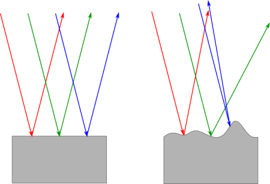

镜面反射遵循反射角和最终出射角度相同：$\theta_r = \theta_o$，所以 Fresnel reflectance：$F(\theta_r)=F(\theta_o)$，扩展到立体角为 $F(\omega_r)=F(\omega_o)$。

所以镜面的能量传递满足以下关系：

$$
L_r(\omega_r)=L_r(\omega_o)=F_r(\omega_r)L_i(r(\omega_r, \mathbf{n}))
$$

其中 $\omega_r = r(\omega_i, \mathbf{n})$ ，即反射方向 $\omega_r$ 与入射方向 $\omega_i$ 关于法线 $\mathbf{n}$ 对称。

BRDF 在半球上积分为 1，相当于一个概率密度分布，积分域为 $\Omega$。

离散卷积里有个 identity kernel，一个离散序列与它做卷积可以等于序列本身。对于连续的光传输方程的情况也是如此，这时候序列就变成了入射进来的 Radiance，而 identity kernel 就变成了 Dirac Delta 函数。

根据第一个反射公式，我们的确需要构造一个带 Delta 分布的 BRDF。因为 Reflectance(Scattering) Equation：

$$
L_r(\omega_r)=\int_{\Omega}f_r(\omega_i,\omega_r)L_i(\omega_i)\cos\theta_i \mathrm{d}\omega_i
$$

除了让 $f_r(\omega_i,\omega_r)$ 里带个能使最后积出来直接带个 $L_i(\omega_r)$ 的 Delta 函数之外，好像就真没法子构造出 $L_r(\omega_r)=F_r(\omega_r)L_i(\omega_r)$ 了。镜面（Mirror/Perfect specular）的反射模型与其它任何反射模型都不一样的是，它只朝一个确定的 $\omega_r$ 发射，不像别的 BRDF 有很大的波瓣；而一维 Dirac Delta 可视化出来就是在 0 处有一个无穷长的箭头，并满足 $\int_{\mathbb{R}}\delta(x)\mathrm{d}x=1$。

Delta 函数与一个函数积分可以明确地挑出一个值：

$$
\int f(x)\delta(x-x_i)\mathrm{d}x = f(x_i)
$$

最后还原到 $f$ 也正是 Delta 函数的 identity 属性，就好像 identity martix $I$ 满足 $IM=M$ 一样。

接下来根据 $L_r(\omega_r)=F_r(\omega_r)L_i(r(\omega_r, \mathbf{n}))$，于是：

$$
L_r(\omega_r)=\int_{\Omega}f_r(\omega_i,\omega_r)L_i(\omega_i)\cos\theta_i \mathrm{d}\omega_i =F_r(\omega_r)L_i(r(\omega_r, \mathbf{n}))
$$

先让 $f_r(\omega_i,\omega_r)=F(\omega_r)\cdot \delta(\omega_i-\omega_r)$ 吧，注意到 Delta 函数的输入是 $\omega_i - \omega_r$，为的是挑出唯一的反射立体角。代入积分：

$$
\int_{\Omega}F(\omega_r) \delta(\omega_i-\omega_r)L_i(\omega_i)\cos\theta_i \mathrm{d}\omega_i =F_r(\omega_r)L_i(r(\omega_r, \mathbf{n})) \cos\theta_i
$$

这显然不太对，因为多了个 $\cos\theta_i$ 出来，所以应该在原来构造的 BRDF 上乘个 $\frac{1}{\cos\theta_i}$，最终得到：

$$
f_r(\omega_i,\omega_r)=\frac{F(\omega_r) \delta(\omega_i-\omega_r)}{\cos\theta_i}
$$

这就是镜面反射的 BRDF。