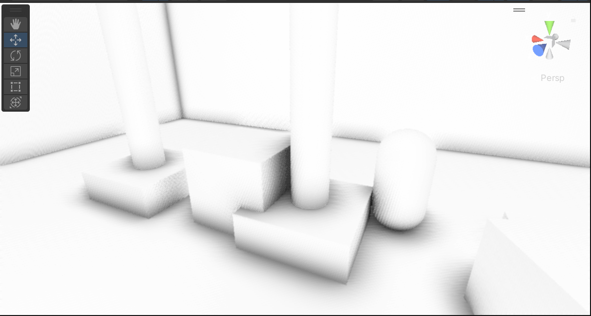
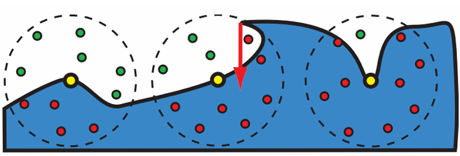
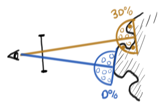
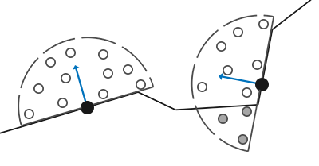

最近在打 taptap 聚光灯的 gamejam，我在队伍里做一些杂活。今天突然想要把 GTAO (Ground Truth Ambient Occlusion) 技术引进到我们的项目里：

加上最近正好有写作欲，于是写下这篇文章。本文不仅是对 GTAO 技术的阐释，还梳理了整个环境光遮蔽技术的发展脉络和未来走向，希望对你有所帮助。

## 环境光遮蔽简介
**环境光遮蔽（Ambient Occlusion, AO）** 是什么？简而言之，就是物体之间接触（或者靠得很近）时，会挡住一部分周围的光照，从而产生阴影，就像上图所示。

其实从 hardcore rendering 的角度而言，大多数所谓的“环境光遮蔽”只是一些低频的间接光照，属于全局光照求解的一部分，它们可以直接通过 path tracing 的方式暴力解算出来（并且效果还更好）。

但是游戏不一样，尤其是对于移动端设备而言，硬件资源和帧时间预算摆在那里，我们不得不思考优化方法。
在游戏领域最早是 Crytek 在著名的 ~显卡危机~ [《孤岛危机》(Crysis, 2007)](https://store.steampowered.com/app/17300/Crysis/) 上首次提出 **屏幕空间环境光遮蔽（Screen-Space Ambient Occlusion, SSAO）**，它的思想非常简单，就是在物体表面周围的一个半球/球区域内撒采样点，然后统计哪些点被挡住：

>红色箭头方向是摄像机看过去的方向，这隐含着判断遮挡需要 Z-Buffer：如果采样点对应的深度值比 Z-Buffer 里记录的更深，就意味着该点被遮挡。

更新一点的环境光遮蔽技术（HBAO, HBAO+, GTAO 等）都是 SSAO 家族的，都基于屏幕空间。除此之外就是基于世界空间的技术，例如基于距离场的 DFAO (Distance Field AO)、基于体素的 VXAO (Voxel AO) 以及光追（RTAO）。
> DFAO 在一款 UE4 游戏 [*Claybook*](https://store.steampowered.com/app/661920/Claybook/) 上有所应用，整个游戏的场景就是符号距离场搭建起来的；
>
> VXAO 在 [《古墓丽影：崛起》]() 上有应用，它专为老黄家的显卡优化，在当时是 N 卡的一大卖点；
>
> RTAO 近几年带光追的游戏很多都有，数不过来，比如 [《赛博朋克 2077》](https://store.steampowered.com/app/1091500/_2077/)、[《侠盗猎车手 5 增强版》](https://store.steampowered.com/app/3240220/Grand_Theft_Auto_V/)、[《死亡搁浅2》](https://store.steampowered.com/app/3280350/2/) 等等。

## 环境光遮蔽的核心问题
环境光遮蔽其实就是全局光照问题的一个子集，要追寻其源头，就必定会追溯到渲染方程：

$$
L_o(\omega_o, p) = \int_{\Omega} f_r(\omega_i, \omega_o, p) L_i(\omega_i, p) \cos\theta_i \mathrm{d}\omega_i
$$
> 这里去掉自发光。

其中 $\Omega$ 是以点 $p$ 为中心的单位半球。这个形式的方程意味着整个半球面的各部分对 $p$ 都有能量贡献，但实际上不是这样，有的地方可能 $L_i = 0$ (出现环境遮挡, 这就是 Ambient Occlusion 最直接的含义)，所以我们需要稍微改写一下：

$$
L_o(\omega_o,p) = \int_{\Omega} f_r(\omega_i, \omega_o, p) L_i(\omega_i, p) V(\omega_i,p) \cos\theta_i \mathrm{d}\omega_i
$$

这里引入一个可见度函数 $V(\omega_i, p)$ ，当 $\omega_i$ 方向的受到物体遮挡时 $V = 0$，表示被遮挡。极端情况就是点 $p$ 周围被完全遮挡，$V \equiv 0$，整个积分值都为 0，完全是黑的；反之当 $V \equiv 1$ 时，表示完全没有受到遮挡，这时候就和上一个方程一样了。

当然，很多情况下是遮挡了一部分，也就是 $V$ 在一些地方等于 0 在另一些地方等于 1，这就是 AO 要解决的问题，我们接下来会进行推理。

## AO 因子
根据积分中值定理 $\int_D f(x)g(x)\,\mathrm{d}x = f(\xi)\int_D g(x)\,\mathrm{d}x$，渲染方程的积分也可以进行拆解。

$$
\begin{aligned} L_o(\omega_o,p) &= \int_{\Omega} f_r(\omega_i, \omega_o, p) L_i(\omega_i, p) V(\omega_i,p) \cos\theta_i \mathrm{d}\omega_i   \\ 
                                &\approx V_{\mathrm{mean}} \int_{\Omega} f_r(\omega_i, \omega_o, p) L_i(\omega_i, p) \cos\theta_i \mathrm{d}\omega_i   \\ 
                                 &= \frac{\int_{\Omega} V(\omega_i,p) \cos\theta_i \mathrm{d}\omega_i}{\int_{\Omega} \cos\theta_i \mathrm{d}\omega_i} \int_{\Omega} f_r(\omega_i, \omega_o, p) L_i(\omega_i, p) \cos\theta_i \mathrm{d}\omega_i   \\ 
                                 &= \frac{\int_{\Omega} V(\omega_i,p) \cos\theta_i \mathrm{d}\omega_i}{\pi} \int_{\Omega} f_r(\omega_i, \omega_o, p) L_i(\omega_i, p) \cos\theta_i \mathrm{d}\omega_i   \\
\end{aligned}
$$

这里很显而易见了，左侧的 $\frac{\int_{\Omega} V(\omega_i,p) \cos\theta_i \mathrm{d}\omega_i}{\pi}$ 就是从单位半球顶部投影下去的**可视区域面积和总面积的比值**，也即半球空间内的 **平均可见度 $V_{\mathrm{mean}}$** 。如果要找一个 AO 控制因子，那么就没有比它更合适的了。

不过，为什么是 "$\approx$" ？因为积分中值定理要求函数 $f$ 在积分域上连续，而可见性函数 $V$ 是一个取值在 $\{0,1 \}$ 的阶跃函数，并不严格满足定理的成立条件。但 who cares!  ~数学家 vs 工程师，你们知道吗（~

需要注意的是，这个约等本身也是有程度的，如果 $f_r L_i \cos\theta_i $ 的支撑集过窄（极小光源、尖锐 BRDF 等），半球总体的平均可见度 $V_{\mathrm{mean}}$ 就会抹掉这些高能量方向的小范围实际可见度，导致最终 radiance 偏小。

## SSAO: Screen Space Ambient Occlusion
前面得到了 AO 因子 $A(p) = \frac{1}{\pi}\int_{\Omega} V(\omega_i,p) \cos\theta_i \mathrm{d}\omega_i$，那么我们就要计算它。在实时渲染里直接算这个积分的精确值是不行的，我们只能做少量的 sampling。

假设已经获得当前像素对应的表面位置 $p$ 和法线 $\mathbf{n}$，在以 $p$ 为中心、沿法线朝向的半球中生成一组采样点：

$$
q_i=p+r_i,\qquad r_i\in \Omega(\mathbf{n})
$$

其中，$\Omega(\mathbf{n})$ 表示以 $\mathbf{n}$ 为朝向的半球，$r_i$ 是采样位置偏移。

将这些采样点投影到屏幕空间，查询对应位置的深度缓冲区，就可以据此判断采样点附近是否存在遮挡几何体（这个过程和 Shadow Mapping 的思想一致），最后做加权平均即可得到 AO 值。

## GTAO: Ground Truth Ambient Occlusion
本文的重点是 GTAO，它是[动视](https://research.activision.com/publications/archives/practical-real-time-strategies-for-accurate-indirect-occlusion)提出的一个方法。刚刚我们看到，虽然 SSAO 的思想确实是估计 AO 因子 $A(p)$，但是却不那么精确，抛开这个数学背景也很好理解。

而 GTAO 则不一样，它的名字就带了个 **"ground truth"**，可以猜出它是一种更硬的方法（事实也的确如此）。

> Ground Truth：中文译名为“基准真相”或“基准真值”，在图形学领域有一种 **“渲染的标准答案”** 的意味。例如，我们经常将 Path Tracing 方法的渲染结果作为 ground truth，比较各类实时 GI 算法的差异。~题外话：path tracing 不一定就是对的（它无法模拟波动光学~

回到 AO 因子的积分式：

$$
A(p) = \frac{1}{\pi}\int_{\Omega} V(\omega_i,p) \cos\theta_i \mathrm{d}\omega_i
$$

事实上，它是一个二重积分，因为我们使用的微分是立体角的，即 $\omega = (\theta, \phi)$。如果要展开成二重积分，根据 $\mathrm d\omega=\sin\theta\,\mathrm d\theta\,\mathrm d\phi$，就得参数化成这样：

$$
\begin{aligned}

A(p)
&=\frac{1}{\pi}\int_0^{2\pi}
\int_0^{\pi/2}
V(\theta,\phi,p)\cos\theta
\sin\theta\,\mathrm d\theta\,\mathrm d\phi\\
&=\frac{1}{\pi}\int_0^{\pi}
\int_{-\pi/2}^{\pi/2}
V(\theta,\phi,p)\cos\theta
|\sin\theta| \mathrm{d}\theta\,\mathrm d\phi

\end{aligned}
$$