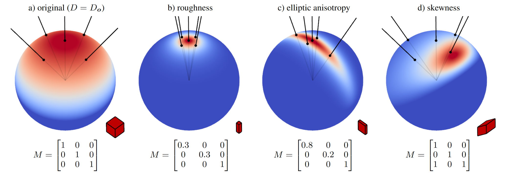

Linearly Transformed Cosines (LTC) 是实时渲染里常用的 PBR 面光反射技巧，它的核心思想是让余弦函数去近似 PBR 渲染里复杂的 BRDF。准确地说，LTC 不是简单地用个普通的余弦函数去拟合 BRDF，而是对余弦函数施加一个**线性变换**（伸缩/错切/旋转变换），这个变换和使其能够拟合**不同视角和不同粗糙度下的 BRDF 波瓣**。

简而言之就是，我们希望将一个难以解析积分的 BRDF，转换为一个容易解析积分的球面余弦函数。

因为像 $\int_{\Omega_L} \frac{
D(h)F(\omega_i,h)G(\omega_i,\omega_o)
}{
4(\mathbf n\cdot\omega_i)(\mathbf n\cdot\omega_o)
} (\mathbf n\cdot\omega_i) \mathrm{d}\omega_i$ 这样的函数没法解析积分，只能靠数值方法（蒙特卡洛光线追踪）；而对于球面余弦积分有 $\int_{\Omega} k(\mathbf n\cdot\omega') \mathrm{d}\omega' =  k \int_{\Omega} (\mathbf n\cdot\omega') \mathrm{d}\omega' = k\pi$ ，被积函数只有 $\cos$，就能一下子就知道解析积分值是多少——对有限面积的面光源而言，其实就是在算投影在单位圆盘上的区域面积是多少。这种快速且解析方法在当代的光栅化游戏里非常流行。

> 注意到 ${\Omega_L}$ 是面光在单位半球面上的投影区域，而不是整个单位半球面

**完整论文 *Real-time polygonal-light shading with linearly transformed cosines*：**
https://dl.acm.org/doi/10.1145/2897824.2925895

**实现效果**：https://www.bilibili.com/video/BV1QTu16qEBt/

